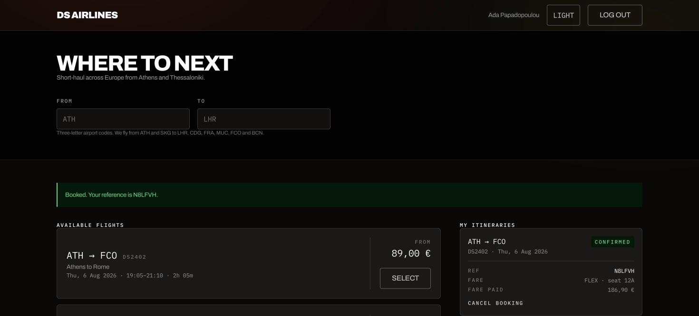
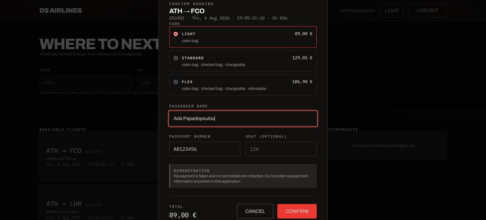
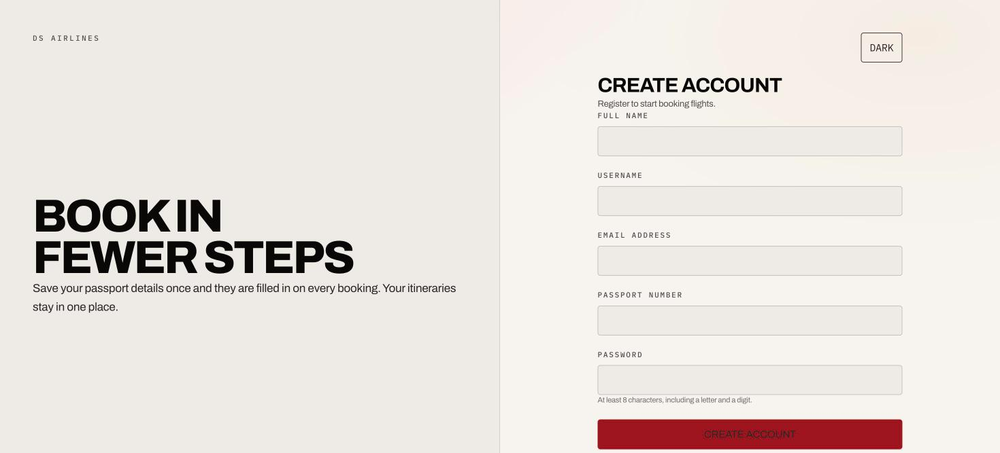
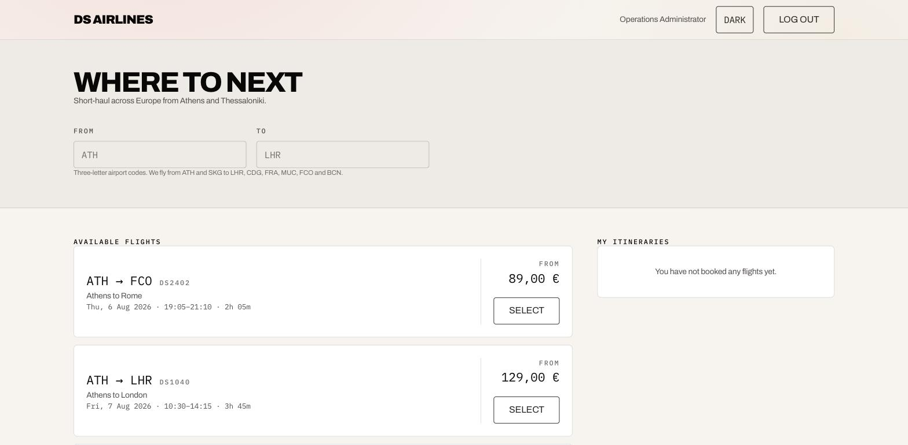

<h1>DS Airlines</h1>

<p>
  <a href="https://github.com/aposfys/DS-Airlines/actions/workflows/ci.yml">
    
  </a>
  
  
  
  
</p>

A flight booking platform for a fictional Greek short-haul carrier — built as
a business, not just a codebase. Brand, product analysis, architecture
decisions and test strategy are first-class artefacts here, alongside the API
and the interface.

**FastAPI · PostgreSQL · SQLAlchemy 2.0 · Alembic · React 19 · TypeScript ·
Tailwind v4 · Docker**



---

## Why this repository exists

It began as a **BSc Digital Systems project**: a Flask app that could list
flights and take a booking. Restarting it as a product meant asking the
questions a university assignment never does — who flies this airline, what
does it promise, what happens when a payment fails, and how would anyone know
if it broke.

The most useful document here is not the API reference. It is the
[**current-state assessment**](docs/analysis/current-state-assessment.md): an
audit of the original code recording all 30 defects found, what each would
have cost the business, and where it was resolved.

Four were Critical:

- **The entire admin surface was unreachable.** Tokens never carried the
  `is_admin` claim that every authorisation check read, so flight creation,
  repricing and withdrawal returned 403 to everyone — including the
  administrator the app seeded for itself.
- **Full card numbers were stored in cleartext**, in the same record as the
  passenger's passport number.
- **Every deployment shipped the same known admin password**, hardcoded, next
  to a signing key committed to this repository.
- **`docker-compose up --build` could not build**, because the frontend image
  pinned Node 18 against a toolchain requiring Node 20+.

The previous README called this "production-ready". Recording why that was
wrong is the point of the exercise.

---

## The interface

Built on **[AF](frontend/src/design-system/README.md)**, a design system of my
own. DS Airlines owns the words; AF owns everything you can see.

| Booking | Register |
|---|---|
|  |  |

Both themes are token-complete and contrast-verified in CI.



> **No payment is taken and no card details are collected.** The booking form
> has no card field, and the API returns `422` to a request carrying one.
> Do not enter real payment information.

---

## Documentation

| | |
|---|---|
| [Current-state assessment](docs/analysis/current-state-assessment.md) | The full defect register, with business impact and resolution |
| [ADR-001 · PostgreSQL over MongoDB](docs/adr/0001-postgresql-over-mongodb.md) | Why the booking engine left the document model |
| [Personas](docs/product/personas.md) · [User stories](docs/product/user-stories.md) | Who this is for, and a story → endpoint → test traceability matrix |
| [Product brand](docs/brand/brandbook.md) | Positioning, network, fare architecture, voice |
| [AF design system](frontend/src/design-system/README.md) | The vendored token layer, and what was deliberately not vendored |
| [Test strategy](docs/qa/test-strategy.md) | Layers, how to run everything, and a 42-case manual pass |
| [Changelog](CHANGELOG.md) | What changed in each phase, including what was removed |
| [Security](SECURITY.md) | Why this takes no payments, how to run it safely, and known limitations |

Start at [`docs/`](docs/README.md), which orders these for a first read.

---

## Roadmap

Each phase leaves the repository runnable and lands on its own branch.

| Phase | Scope | Status |
|---|---|---|
| **0 · Foundation** | Defect register, critical fixes, CI, repo hygiene | **Complete** — [`v0.1.0`](https://github.com/aposfys/DS-Airlines/releases/tag/v0.1.0) |
| **1 · Domain** | PostgreSQL, routes and schedules, fare classes, seat maps, AF design system, full test suites | **Complete** — [`v0.2.0`](https://github.com/aposfys/DS-Airlines/releases/tag/v0.2.0) |
| **2 · Booking engine** | Seat maps in the interface, holds with expiry, cancellation policy per fare | Next |
| **3 · Payments & comms** | Provider-tokenised payment, email confirmations | Planned |
| **4 · Operations** | An interface for the admin surface, which today is API-only | Planned |
| **5 · Presentation** | Published brand and analysis site | Planned |

Versions stay pre-1.0 deliberately: payment capture and the operations
interface do not exist, and 1.0.0 would overclaim.

---

## Running it

### Docker — needs nothing else installed

```bash
cp .env.example .env
# SECRET_KEY and POSTGRES_PASSWORD are required; the app refuses to start without them
python -c "import secrets; print(secrets.token_urlsafe(48))"

make up
```

### Natively

Needs `postgresql@17`, Python 3.13 and Node 22.

```bash
make setup   # venv, npm ci, a database cluster in .pgdata, migrations
make seed    # demo flights and an administrator
make dev     # API on :8000, interface on :5173
```

The cluster lives in `.pgdata` inside the repo on port 55432, so it cannot
collide with any PostgreSQL you already run. `make db-reset` throws it away.

| | |
|---|---|
| Interface | http://localhost:5173 (`make dev`) or :3000 (`make up`) |
| API | http://localhost:8000 |
| Swagger UI | http://localhost:8000/docs |

Demo data is opt-in. Nothing is seeded unless you ask, and there are no
default credentials — `make seed` supplies its own, for local use only.

**The administrative surface has no interface.** Publishing flights,
repricing and load factor all run through Swagger. That is Phase 4, and it is
the largest gap between what the product does and what a person could use.

---

## Tests

```bash
make check       # backend + component tests, lint, build, contrast
make check-all   # the above plus end to end
```

| | |
|---|---|
| `make test` | **89** backend tests against real PostgreSQL |
| `make test-frontend` | **69** component tests (Vitest + Testing Library) |
| `make e2e` | **17** end-to-end tests in a real browser (Playwright) |
| `make contrast` | 34 colour pairs, WCAG 2.2 AA, in both themes |

**175 automated tests**, all in CI.

The backend suite runs against a **real PostgreSQL**, and the fixtures build
the schema by running the Alembic migrations — so every run also proves the
migration chain applies.

That matters because of what it replaced. The original six tests all
exercised the same two auth endpoints, since anything touching flights,
bookings or authorization needed a database they had no way to provide —
which is precisely why a completely dead admin surface sat in the repository
alongside a green suite.

The tests that matter most assert the defects stay fixed:

```
tests/test_authorization.py   an admin gets 200, a passenger gets 403,
                              revoking admin takes effect before expiry
tests/test_bookings.py        payment details are refused outright,
                              cancelling twice cannot credit a seat back
tests/test_flights.py         search does no pattern matching,
                              a flight with bookings cannot be deleted
tests/test_constraints.py     the database itself refuses bad data
e2e/interface.spec.ts         the webfonts actually load
```

That last one exists because they once did not. Nested under Tailwind's
`@import`, the production build shipped **zero** `.woff2` files and the whole
typographic identity fell back to Helvetica **with no error of any kind**.
Four Phase 1 defects were invisible to a green unit suite; the end-to-end
suite is the answer to that.

---

## Project layout

```
backend/
  app/
    config.py         Validated settings; refuses a weak or missing SECRET_KEY
    db.py             Engine and one-session-per-request
    auth.py           JWT issuance, hashing, authorization dependencies
    models/domain.py  The relational domain — ten tables
    schemas.py        API request and response models
    routers/          auth · flights · bookings · admin
  migrations/         Alembic revisions
  scripts/seed.py     Explicit seeding, never a startup side effect
  tests/              89 tests against real PostgreSQL
frontend/
  e2e/                Playwright — the journey, fonts, themes, accessibility
  src/
    design-system/    Vendored AF tokens, fonts, accessibility standard
    index.css         AF tokens bridged into Tailwind
    components/       BookingDialog · ThemeToggle
    context/          AuthContext · ThemeContext
    pages/            Login · Register · Dashboard
                      *.test.tsx sit beside what they test
docs/
  adr/                Architecture decisions
  analysis/           Current-state assessment
  brand/              Product brand, contrast check
  product/            Personas, user stories, traceability
  qa/                 Test strategy and the manual pass
```

---

## Licence

[MIT](LICENSE) · Apostolos Fysekidis

DS Airlines is a fictional carrier created for this project. It is not
affiliated with any real airline or alliance.
